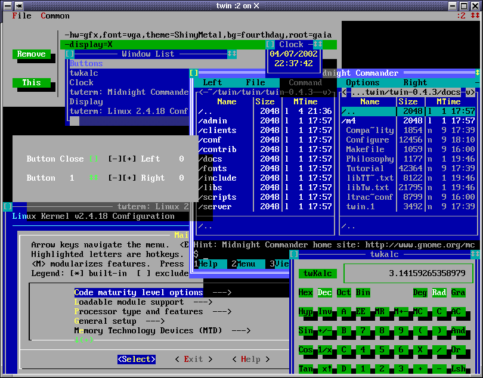

--------------------------------------------------------------
Twin - a Textmode WINdow environment
--------------------------------------------------------------

Version 0.9.1

Twin is text-based windowing environment with mouse support, window manager,
truecolor terminal emulator, networked clients and the ability to attach/detach
mode displays on-the-fly.

It supports a variety of displays:
* plain text terminals: Linux console, twin's own terminal emulator,
  and any termcap/ncurses compatible terminal;
* X11, where it can be used as a multi-window xterm;
* itself (you can display a twin on another twin);
* twdisplay, a general network-transparent display client, used
  to attach/detach more displays on-the-fly.

Currently, twin is tested on Linux (i386, x86_64, arm, arm64, PowerPC, Alpha, Sparc),
on macOS (x86_64, arm64), on FreeBSD (i386, x86_64) and on Android (arm64 both on termux and UserLand).
I had yet no chance to seriously test it on other systems.

The following screenshot shows an example of twin with various clients:



Documentation
--------------------------------------------------------------


[Tutorial](docs/Tutorial)
	A quite complete tour of twin features: the user interface,
	how to use twin clients, compression, attaching/detaching
	displays, fonts. It also contains installation instructions
	and some caveats for system administrators.

[COPYING](COPYING)
	License: twin server and clients are GPL'ed software.

[COPYING.LIB](COPYING.LIB)
	Library license: the libraries libtutf, libtw
	are LGPL'ed software.

[INSTALL](INSTALL)
	Quick compile/install guide.

[twinrc](twinrc)
	A detailed example of ~/.config/twin/twinrc look-n-feel configuration file.

The following documentation is useful mostly to developers:

[Configure](docs/Configure)
	Description of twin configuration options with the meaning
	of every single one.

[README.git](README.git)
	Hints to build twin from GIT repository.

[README.porting](README.porting)
	Tips and warnings to compile twin on unsupported OSes.

[libtw.txt](docs/libtw.txt)
	reference API for programmers who want to write twin clients (INCOMPLETE).

[libtw++.txt](docs/libtw++.txt)
	reference API for programmers who want to write	twin C++ clients (INCOMPLETE).

--------------------------------------------------------------
Getting twin


Since you are reading this README, you probably already have it,
anyway twin can be downloaded from

https://github.com/cosmos72/twin

--------------------------------------------------------------
Building and installing twin

For detailed instructions about compiling and installing twin,
see sections 3 and 4 of the file [docs/Tutorial](docs/Tutorial)

For the impatient, it basically reduces to
```
  ./configure
  make
```
then run as root
```
  make install
```
on Linux, also remember to run as root:
```
  ldconfig
```
on FreeBSD instead, remember to run as root:
```
  ldconfig -R
```

To compile twin you need the following programs installed
on your system:

  * a Bourne-shell or compatible (for example bash, dash, ash...)

  * make (most variants are supported: GNU make, BSD make...)

  * an ANSI C compiler (for example gcc or clang)

  * a C++ 98 compiler (for example g++ or clang++)


Note: it is STRONGLY recommended to install at least the following packages before compiling twin
(the exact names depend on the operating system or Linux distribution):

  * x11-dev      - may be named x11-devel, libx11-dev ...
  * xft-dev      - may be named xft-devel, libxft-dev ...
  * ncurses-dev  - may be named ncurses-devel, libncurses-dev ...
  * zlib-dev     - may be named zlib1g-dev, zlib-devel, libzlib-dev ...

On Linux, it is STRONGLY recommended to also install the following package before compiling twin:

  * gpm-dev      - may be named gpm-devel, libgpm-dev ...

For a discussion about MANUALLY configuring twin (almost never necessary),
see the file [docs/Configure](docs/Configure).
-- WARNING: if you manually enable options that were disabled by `./configure',
build will almost certainly fail! --

--------------------------------------------------------------
Other topics:

See the rest of the documentation, starting from the [Tutorial](docs/Tutorial)


Greetings,

Massimiliano Ghilardi
